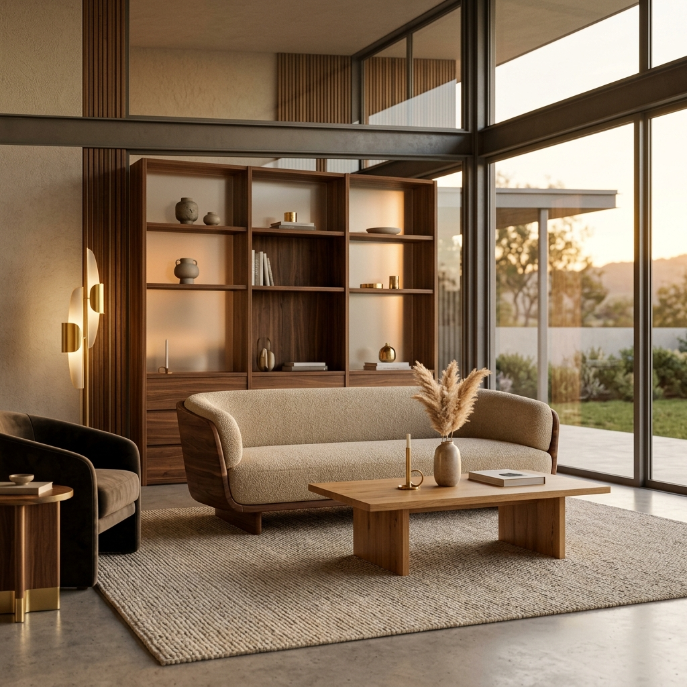

<div align="center">
  

  # 🛋️ Furniro
  ### Elevated Furniture for Modern Living
  
  [](https://nextjs.org/)
  [](https://tailwindcss.com/)
  [](https://www.typescriptlang.org/)
  [](https://redux-toolkit.js.org/)

  **Furniro** is a high-performance, cinematic e-commerce platform dedicated to luxury furniture. Crafted with a focus on immersive user experience, glassmorphic design, and seamless interactivity.

  [Core Experience](#-core-features) • [Tech Stack](#-technology-stack) • [Getting Started](#-getting-started) • [Architecture](#-project-structure)
</div>

---

## ✨ Core Features

### 🛍️ Premium Catalog Experience
*   **Dynamic Product Discovery**: Advanced filtering and sorting systems built with performance in mind.
*   **Cinematic Galleries**: High-resolution image showcases with smooth transitions and zoom capabilities.
*   **Detailed Information**: Comprehensive product breakdowns including specifications, agreements, and rich descriptions.

### 🔐 Secure User Ecosystem
*   **Unified Authentication**: Elegant login and registration flows featuring real-time validation.
*   **Personalization**: Persistent user sessions and profile management via Redux Toolkit.
*   **Smart Forms**: Robust data handling using `React Hook Form` and `Zod` for type-safe validation.

### 🚀 Performance & UX
*   **Silk-Smooth Motion**: Integrated [Lenis](https://lenis.darkroom.engineering/) for high-end inertial scrolling.
*   **Glassmorphic UI**: Modern aesthetic using semi-transparent layers and blurred backdrops for a premium feel.
*   **Responsive Precision**: Meticulously crafted for all devices, from mobile to ultra-wide displays.
*   **Instant Feedback**: Non-intrusive `Sonner` toast notifications for all system events.

---

## 🛠️ Technology Stack

| Category | Technology | Purpose |
| :--- | :--- | :--- |
| **Framework** | [Next.js 15](https://nextjs.org/) | App Router architecture, Server Components, and optimized rendering. |
| **Styling** | [Tailwind CSS 4](https://tailwindcss.com/) | Cutting-edge CSS engine for rapid, maintainable design. |
| **State** | [Redux Toolkit](https://redux-toolkit.js.org/) | Centralized, predictable application state management. |
| **Motion** | [Lenis](https://lenis.darkroom.engineering/) | Premium smooth-scrolling engine for immersive browsing. |
| **Forms** | [React Hook Form](https://react-hook-form.com/) | Performant, flexible, and extensible forms with validation. |
| **Validation** | [Zod](https://zod.dev/) | TypeScript-first schema declaration and validation. |
| **UI Library** | [Shadcn UI](https://ui.shadcn.com/) | Accessible, beautiful primitive components. |

---

## 🏗️ Project Structure

```bash
frontend/
├── app/                  # Next.js App Router (Routing & Pages)
├── components/           
│   ├── customs/          # Brand-specific specialized components (Hero, Gallery, etc.)
│   └── ui/               # Reusable primitive UI atoms (Shadcn UI)
├── services/             # API communication layer (Axios instances & services)
├── stores/               # Global state management logic (Redux Slices & Hooks)
├── schema/               # Type-safe request/response definitions
├── lib/                  # Shared utilities and helper functions
└── public/               # High-resolution assets and media
```

---

## 🚀 Getting Started

### Prerequisites
*   **Node.js**: v18.0 or higher
*   **Package Manager**: `npm` or `yarn`

### Installation

1.  **Clone & Navigate**:
    ```bash
    git clone https://github.com/NaGit09/FE-Furniro.git
    cd FE-Furniro
    ```

2.  **Install Runtime**:
    ```bash
    npm install
    ```

3.  **Launch Workspace**:
    ```bash
    npm run dev
    ```

4.  **Explore**: Navigate to `http://localhost:3000` to view the application.

---

## 🎨 Design Identity

Furniro's aesthetic is built on three pillars:
1.  **Warm Minimalism**: Neutral tones paired with wood-inspired accents (#B88E2F).
2.  **Visual Depth**: Strategic use of shadows and glassmorphism to create a layered interface.
3.  **Typography**: Clean, professional sans-serif hierarchy for maximum readability.

---

<div align="center">
  Developed with excellence for the modern web.
  <br />
  <b>© 2026 Furniro. All rights reserved.</b>
</div>

